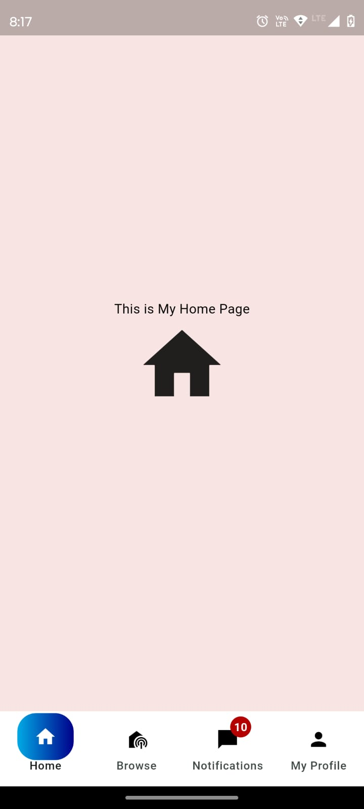

# Gradient Bottom Navbar

A highly customizable bottom navigation bar with a gradient indicator, animations, and support for counters. Perfect for adding modern and visually appealing navigation to your Flutter app.

---

## Features

- Gradient indicator with customizable height, width, and border radius.
- Smooth animations for screen transitions and indicator movement.
- Customizable item colors for selected and unselected states.
- Support for counters (badges) on navigation items.
- Fully responsive and easy to integrate.

---

## Installation

Add the following line to your `pubspec.yaml` file:

```yaml
dependencies:
  gradient_bottom_navbar: ^1.0.0

Then, run:

bash
Copy code
flutter pub get

Usage
Wrap your app's main screen with the GradientBottomNavbar widget.

import 'package:flutter/material.dart';
import 'gradient_bottom_navbar.dart';

void main() {
  runApp(const MyApp());
}

class MyApp extends StatelessWidget {
  const MyApp({Key? key}) : super(key: key);

  @override
  Widget build(BuildContext context) {
    return MaterialApp(
      debugShowCheckedModeBanner: false,
      home: GradientBottomNavbar(
        items: [
          GradientNavItem(icon: Icons.home, label: 'Home'),
          GradientNavItem(icon: Icons.search, label: 'Search', counter: 5),
          GradientNavItem(icon: Icons.settings, label: 'Settings'),
        ],
        screens: [
          const Center(child: Text('Home Screen')),
          const Center(child: Text('Search Screen')),
          const Center(child: Text('Settings Screen')),
        ],
        indicatorGradient: const LinearGradient(
          colors: [Colors.blue, Colors.purple],
        ),
        backgroundColor: Colors.white,
        selectedItemColor: Colors.white,
        unselectedItemColor: Colors.grey,
      ),
    );
  }
}


## Screenshot





GradientBottomNavbar

| **Property**              | **Type**                     | **Default Value**                           | **Description**                                         |
|---------------------------|------------------------------|---------------------------------------------|---------------------------------------------------------|
| items                     | List<GradientNavItem>        | Required                                    | List of navigation items.                              |
| screens                   | List<Widget>                 | Required                                    | List of screens corresponding to the navigation items.  |
| indicatorHeight           | double                       | 50.0                                        | Height of the gradient indicator.                       |
| indicatorWidth            | double                       | 60.0                                        | Width of the gradient indicator.                        |
| indicatorBorderRadius     | BorderRadiusGeometry        | BorderRadius.all(Radius.circular(20))       | Border radius for the indicator.                        |
| indicatorGradient         | Gradient                     | LinearGradient(colors: [LightBlue, DarkBlue])| Gradient used for the indicator.                        |
| backgroundColor           | Color                        | Colors.white                                | Background color of the navigation bar.                 |
| selectedItemColor         | Color                        | Colors.white                                | Color of the selected navigation item.                  |
| unselectedItemColor       | Color                        | Colors.black                                | Color of the unselected navigation items.               |
| barBorderRadius           | BorderRadiusGeometry?       | null                                        | Border radius for the navigation bar.                   |
| animationDuration         | Duration                     | Duration(milliseconds: 300)                 | Duration of the animation for screen transitions and indicator movement. |
| animationCurve            | Curve                        | Curves.easeInOut                            | Curve for the animations.                               |
| counterColor              | Color                        | Color(0xFFB50000)                           | Color of the counters (badges) on navigation items.     |

---

### GradientNavItem Properties Table

| **Property**  | **Type**     | **Description**                                        |
|---------------|-------------|--------------------------------------------------------|
| icon          | IconData    | Icon for the navigation item.                          |
| label         | String      | Label for the navigation item.                         |
| counter       | int?        | Optional counter to display a badge on the navigation item. |


License
This package is licensed under the MIT License. See the LICENSE file for details.

Contributions
Contributions, issues, and feature requests are welcome! Feel free to check out the issues page.

Author
Developed by Piyush Deshmane.  If you enjoy this package , feel free to star the repository and share your feedback!